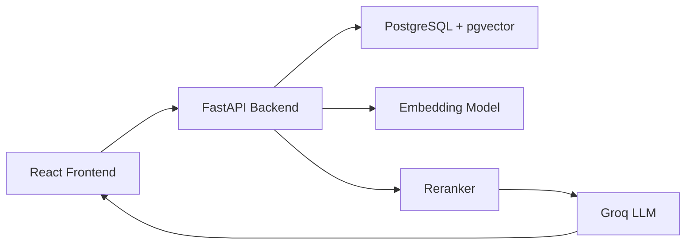

# 📚 Grounded
### Ask questions about your documents — with answers backed by evidence.


Grounded is a Retrieval-Augmented Generation (RAG) application that lets you upload documents and ask questions in natural language. Instead of generating unsupported responses, every answer is grounded in the uploaded documents and accompanied by the passages used to produce it.

---

## ✨ Features

- 📄 Upload PDF, TXT and Markdown documents
- 🔍 Hybrid semantic + keyword search
- 🧠 Transformer-based embeddings
- 🎯 Intelligent passage reranking
- 🤖 AI-generated answers using Groq LLM
- 📑 Evidence-backed responses
- ⚡ Search latency breakdown
- 📚 Multi-document knowledge base

---

# Architecture



---

# Retrieval Pipeline


---

# Screenshots

Replace these with screenshots from your application.

| Dashboard | Question Answering |
|-----------|--------------------|
|  |  |

| Uploaded Documents | Source Passages |
|--------------------|-----------------|
|  |  |

---

# Technology Stack

## Backend

- Python 3.11+
- FastAPI
- SQLAlchemy
- PostgreSQL
- pgvector
- Sentence Transformers
- Groq API

## Frontend

- React
- TypeScript
- Vite

## Infrastructure

- Docker
- Docker Compose

---

# Project Structure

```
Grounded/
│
├── backend/
│   ├── app/
│   ├── services/
│   ├── models/
│   ├── core/
│   └── ...
│
├── frontend/
│   ├── src/
│   ├── public/
│   └── ...
│
└── README.md
```

---

# How It Works

1. Upload one or more documents.
2. Documents are split into smaller chunks.
3. Each chunk is converted into vector embeddings.
4. Embeddings are stored in PostgreSQL using pgvector.
5. A user question is embedded in the same vector space.
6. Hybrid retrieval combines semantic similarity and keyword search.
7. A reranker selects the most relevant passages.
8. The selected context is sent to the language model.
9. The model generates an answer strictly based on the retrieved evidence.

---

# Prerequisites

Install the following before running the application.

| Software | Version |
|-----------|---------|
| Python | 3.11+ |
| Node.js | 18+ |
| Docker Desktop | Latest |
| Groq API Key | Required |

---

# Backend Setup

Navigate to the backend folder.

```bash
cd backend
```

## Start PostgreSQL

```bash
docker compose up -d
```

---

## Create Virtual Environment

### Windows

```bash
python -m venv .venv

.venv\Scripts\activate
```

### Linux/macOS

```bash
python -m venv .venv

source .venv/bin/activate
```

---

## Install Dependencies

```bash
pip install -e .

pip install sentence-transformers
```

---

## Configure Environment

Create a `.env` file.

```env
OPENAI_API_KEY=placeholder
```

Although the application uses Groq, this setting is currently required during startup.

---

## Configure Groq

Open

```
backend/app/services/llm.py
```

Insert your API key.

```python
_client = AsyncOpenAI(
    api_key="YOUR_GROQ_API_KEY",
    base_url="https://api.groq.com/openai/v1"
)
```

---

## Start Backend

```bash
uvicorn app.main:app --reload --port 8000
```

Verify:

```
http://localhost:8000/health
```

Swagger API documentation:

```
http://localhost:8000/docs
```

---

# Frontend Setup

Navigate to the frontend folder.

```bash
cd frontend
```

Install dependencies.

```bash
npm install
```

Create the environment file.

Windows

```bash
copy .env.example .env
```

Linux/macOS

```bash
cp .env.example .env
```

Start the development server.

```bash
npm run dev
```

Open

```
http://localhost:3000
```

---

# Configuration

Most application settings are available in

```
backend/app/core/config.py
```

| Setting | Description |
|----------|-------------|
| chunk_size | Number of tokens per chunk |
| chunk_overlap | Overlap between chunks |
| top_k | Initial retrieval count |
| rerank_top_n | Final passages sent to LLM |
| use_hybrid_search | Enable hybrid retrieval |
| use_reranker | Enable reranking |
| track_latency | Measure pipeline timings |

---

# Daily Workflow

1. Start Docker.
2. Start the backend.
3. Start the frontend.
4. Upload a document.
5. Ask a question.
6. Review the generated answer.
7. Inspect supporting passages.

---

# Troubleshooting

### Backend Offline

Ensure the backend is running on port **8000**.

---

### No Relevant Answer

Possible causes:

- The document does not contain the requested information.
- Increase retrieval depth.
- Increase `rerank_top_n`.
- Re-upload documents after changing chunk settings.

---

### Port 3000 Already In Use

Stop the process using port 3000 and restart the frontend.

---

### PDF Returns No Content

Only searchable PDFs are supported.

Scanned image PDFs require OCR before uploading.

---

### Slow First Request

The embedding and reranking models are downloaded during the first request.

Subsequent requests are significantly faster.

---

# Future Improvements

- Streaming responses
- User authentication
- Chat history
- Document collections
- OCR support
- Citation export
- Cloud deployment
- Multi-model support

---

# License

This project is released under the MIT License.

---

## Acknowledgements

Built using:

- FastAPI
- React
- PostgreSQL
- pgvector
- Sentence Transformers
- Groq API

---

<p align="center">
Built with ❤️ for grounded, explainable document question answering.
</p>
